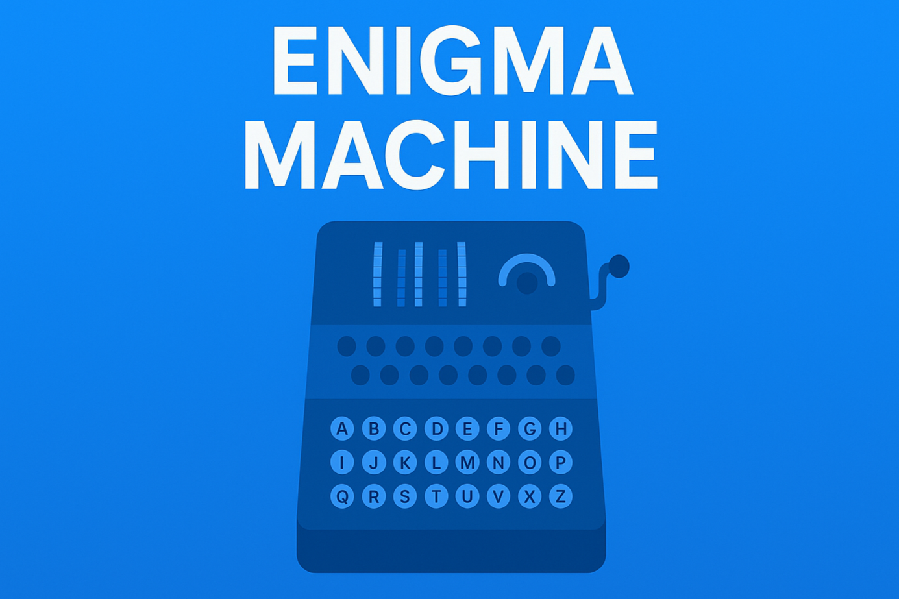

# EnigmaVision


**EnigmaVision** is an interactive simulator of the Enigma machine built with React. It allows you to experience encoding and decoding messages using a modern, visual interface.

## 🚀 Getting Started

To run the project locally:

1. **Clone the repository:**
   
```bash
   git clone https://github.com/matinrezaeifard/EnigmaVision.git
```

2. **Navigate to the project folder:**

```bash
   cd EngimaVision
```

3. **Install dependencies:**

```bash
  npm install
```

4. **Start the development server:**

```bash
  npm start
```

5. **Open in browser:**
Visit `http://localhost:3000` to interact with the Enigma machine.

## 🧩 Features

- Authentic Enigma Simulation: Encode and decode messages using a modern, interactive interface.
- Interactive UI: Adjust rotor positions, and configure the plugboard.
- Multiple Rotors: Supports Left, Middle, and Right rotors with different types.
- Lampboard Visualization: Observe encrypted characters light up in real time.
- Virtual Keyboard: Type directly into the simulator or click letters on the keyboard.
- Plugboard Management: Connect up to 10 pairs of letters to change encryption.

## 💡 How to Use

1. Adjust rotors:
   - Select rotor types (I, II, III).
   - Set the rotor starting positions (A–Z).
2. Configure plugboard by clicking letters to connect them in pairs.
3. Enter plaintext in the input field.
4. View ciphertext in real time as you type.
5. Use the virtual keyboard for interactive typing and lampboard visualization.

## 🛠️ Technology Stack
- React – Frontend library for UI components
- Tailwind CSS – Styling and layout
- JavaScript – Core logic for encryption and rotor mechanics

## 📸 Screenshots


